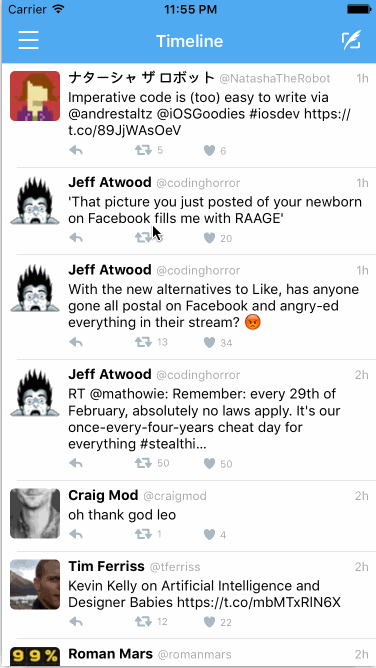

# Project 4 - Tori

## User Stories

The following **required** functionality is completed:

- [x] Hamburger menu
   - [x] Dragging anywhere in the view should reveal the menu.
   - [x] The menu should include links to your profile, the home timeline, and the mentions view.
   - [x] The menu can look similar to the example or feel free to take liberty with the UI.
- [x] Profile page
   - [x] Contains the user header view
   - [x] Contains a section with the users basic stats: # tweets, # following, # followers
- [x] Home Timeline
   - [x] Tapping on a user image should bring up that user's profile page

The following **optional** features are implemented:

- [x] Profile Page
   - [x] Implement the paging view for the user description.
   - [ ] As the paging view moves, increase the opacity of the background screen. See the actual Twitter app for this effect
   - [ ] Pulling down the profile page should blur and resize the header image.
- [ ] Account switching
   - [ ] Long press on tab bar to bring up Account view with animation
   - [ ] Tap account to switch to
   - [ ] Include a plus button to Add an Account
   - [ ] Swipe to delete an account

The following **additional** features are implemented:
- [x] UI/UX
   - [x] Added icons for menu and new tweet
   - [x] Tap hamburger icon to open and close menu
   - [x] Animate logout
   - [x] Display user tweets in profile scene (tap stat to see)
   - [x] Display followers in profile scene (tap stat to see)
   - [x] Display following (friends) in profile scene (tap stat to see)
   - [x] Improved look of login scene
   - [x] Created custom app logo and icon
   - [x] Profile layout was implemented to ensure that the user can read the user name, screen name, description regardless ot the background color of their banner image. I intended to use the `profile_text_color` value, but realized that few users set it. CodePath, for example, uses a dark banner image, but also has their `profile_text_color` set to black. While other Twitter users have light or white banner images. So there was no easy way to ensure the text was readable without some kind of background. I also wanted to make sure the page controll was visible, other wise the user would not know to page to see the description.
- [x] Code/architecture
   - [x] Created custom views for profile header and description
   - [x] Refactor tweet table view cell into XIB for reuse on profile scene

Please list two areas of the assignment you'd like to **discuss further with your peers** during the next class (examples include better ways to implement something, how to extend your app in certain ways, etc):

  1. How did people implement adding and persisting multiple Twitter accounts
  2. Correct way to set constraints or set dimension after device rotation (espicially in ragard to scroll view with paging content size).

## Video Walkthrough

Here's a walkthrough of implemented user stories:

GIF created with [LiceCap](http://www.cockos.com/licecap/).

## Notes

Describe any challenges encountered while building the app.

## License

    Copyright 2016 Marc Adam Anderson

    Licensed under the Apache License, Version 2.0 (the "License");
    you may not use this file except in compliance with the License.
    You may obtain a copy of the License at

        http://www.apache.org/licenses/LICENSE-2.0

    Unless required by applicable law or agreed to in writing, software
    distributed under the License is distributed on an "AS IS" BASIS,
    WITHOUT WARRANTIES OR CONDITIONS OF ANY KIND, either express or implied.
    See the License for the specific language governing permissions and
    limitations under the License.